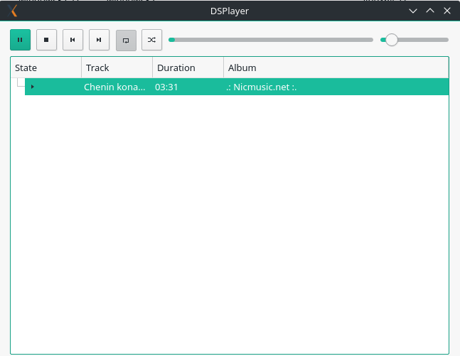
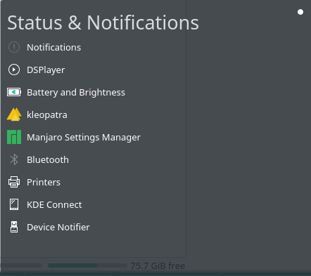

# DSPlayer

## About
DSPlayer is Qt5 dead simple player written in c++ for *nix-like systems.

## Build

The following instructions assume that commands are executed in DSPlayer repository directory.

#### Linux, BSD and similar (Qt/*NIX version)

* install cmake
* `mkdir -p build`
* `cd build`
* `cmake -G "Unix Makefiles" ..`
* `make`

## Screenshot
* Main window

* Tray icon

